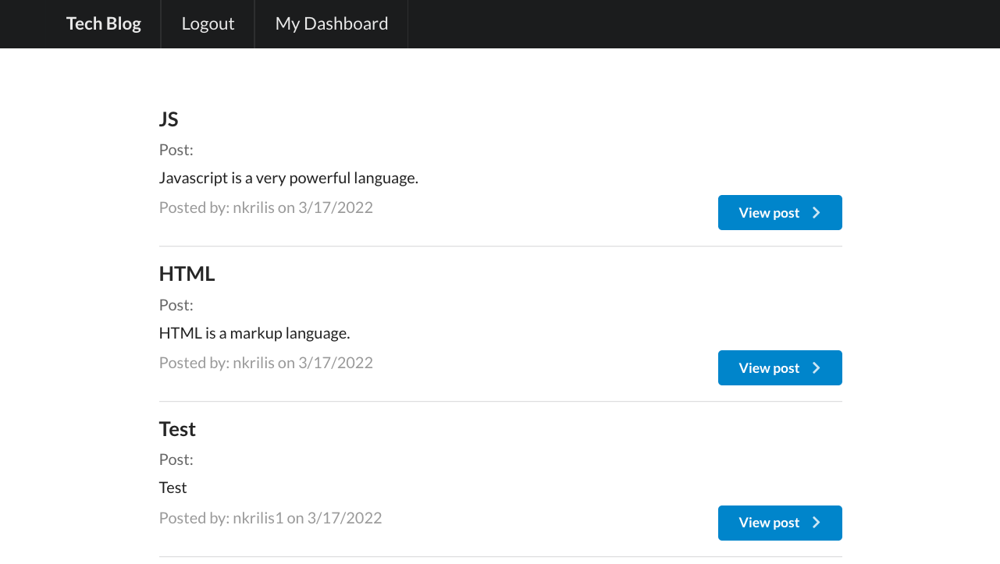

# Tech Blog

  

  ## Description
  
  Tech Blog gives a user the ability to view blog posts made by various users. When a user creates an account they will have the ability to create their own blog posts and comment on other user's blog posts. The user also has the ability to update their blog posts at any time through their dashboard.

  [View the live deployment here](https://nkrilis-tech-blog.herokuapp.com/)

  ### Login Page
  

  ### Signup Page
  

  ### Homepage Page
  

  ### Comment Page
  

  ### Dashboard Page
  

  ### Update Page
  
  
  ## Table of Contents
  
  - [Installation](#installation)
  - [Usage](#usage)
  - [Contributing](#how-to-contribute)
  - [Tests](#tests)
  - [Qyestions](#questions)
  - [License](#license)
  
  ## Installation
  In order to install the project you must first clone this repo to your local machine. Once cloned you can run `npm install` to install all the necessary dependencies to run the application. You must also initialize the database through the database `schema.sql` file. To do this run `mysql -u root -p` and enter your password when prompted. From the main directory of the application, in the `mysql` enviornment run `source ./db/schema.sql` this will create the database for the application.
  ## Usage
  Once the installation process is complete you should now create a `.env` file in the main directory of the application and include three variables: `DB_USER= your mysql user name`, `DB_PW= your mysql password`, and `DB_NAME=ecommerce_db` these are the rquired variables that allows the application to connect to the `mysql` database. After this is completed you can run `npm start` to initialize the database with the tables defined by the `sequilize` model classes. Quit the instance of the application run and run `node ./seeds/index.js` from the main directory in order to seed the database with sample data. You can now run the application again through `npm start` and test the get, post, put, and delete routes through insomnia or any other route testing application.
  ## How to Contribute
  This application is solely created by Nicholas Krilis. If you would like to make changes to this project please fork the repo and submit your changes via a pull request. I will take a look and if all looks good I will merge, Thank you!
  ## Tests
  There are no testing suites associated with this project.
  ## Questions
  [Here you can view my Github Account](https://github.com/nkrilis)

  If you have any questions or would like to reach me you can contact me at [n.krilis@gmail.com](mailto:n.krilis@gmail.com?subject=[GitHub]%20Source%20Han%20Sans)

  ## License

    Copyright 2022 Nicholas Krilis

    Permission is hereby granted, free of charge, to any person obtaining a copy of 
    this software and associated documentation files (the "Software"), to deal in the 
    Software without restriction, including without limitation the rights to use, 
    copy, modify, merge, publish, distribute, sublicense, and/or sell copies of the Software, 
    and to permit persons to whom the Software is furnished to do so, subject 
    to the following conditions:

    The above copyright notice and this permission notice shall be included in all copies 
    or substantial portions of the Software.

    THE SOFTWARE IS PROVIDED "AS IS", WITHOUT WARRANTY OF ANY KIND, EXPRESS OR IMPLIED, 
    INCLUDING BUT NOT LIMITED TO THE WARRANTIES OF MERCHANTABILITY, FITNESS FOR A PARTICULAR 
    PURPOSE AND NONINFRINGEMENT. IN NO EVENT SHALL THE AUTHORS OR COPYRIGHT HOLDERS BE LIABLE 
    FOR ANY CLAIM, DAMAGES OR OTHER LIABILITY, WHETHER IN AN ACTION OF CONTRACT, TORT OR OTHERWISE, 
    ARISING FROM, OUT OF OR IN CONNECTION WITH THE SOFTWARE OR THE USE OR OTHER DEALINGS IN THE SOFTWARE.
    
  